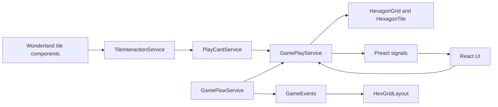
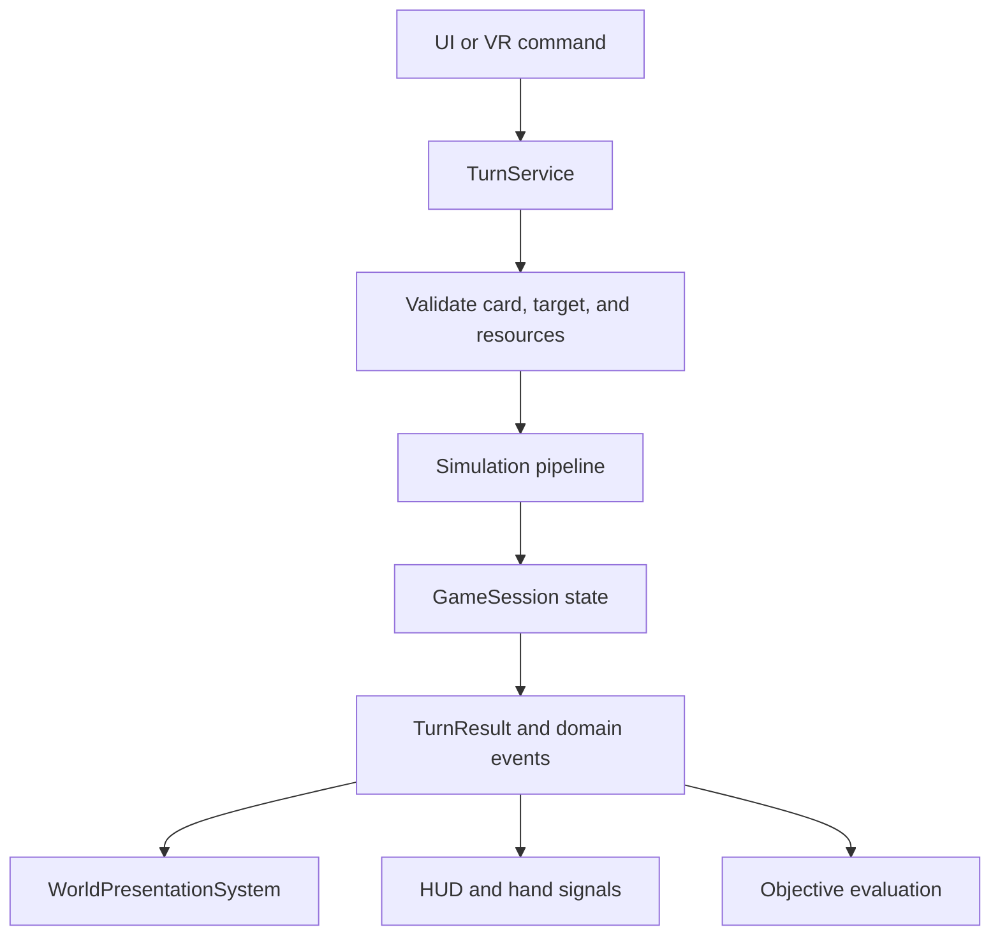

# Elemental Echoes Architecture Assessment

## Scope

This assessment covers the current TypeScript gameplay, Wonderland Engine components, and React UI implementation. It is based on the current code and the intended game loop in `docs/Elemental_Echoes_GDD.md`.

## Current Architecture

The project has a sensible early vertical-slice structure:

- `bootstrap-services.ts` is the composition root for singleton services and models.
- `GameFlowService` starts a run and emits a `gameStarted` event.
- `GamePlayService` owns the deck, hand signal, selected card, and in-memory grid.
- `PlayCardService` maps a clicked tile to a selected-card action.
- Wonderland components handle spawning, hover feedback, and input forwarding.
- React UI receives the main services through context and reads signal state.

The direction matches the GDD's desired separation between interaction, simulation, and rendering. The highest-value work now is making the simulation state authoritative and observable so the rest of the game can grow around it.

## What Is Working Well

- The hex-grid domain is already independent of Wonderland Engine APIs. `HexagonGrid` and `HexagonTile` are a good base for deterministic simulation tests.
- Input is decoupled from card effects. `TileInteraction` publishes intent through `TileInteractionService`, instead of directly mutating a tile component.
- The UI has a usable dependency boundary through `GameServicesProvider`, and signals are appropriate for small reactive UI state such as the hand and selected card.
- Terrain definitions and card definitions are data-driven. This will make balancing and content expansion inexpensive once their rules are consumed by the simulation.
- Component event subscriptions correctly use Wonderland lifecycle methods in the tile interaction and highlight components.

## Key Risks

### 1. Simulation state and presentation are not synchronized

`HexGridLayout` determines and spawns a tile model only in response to `gameStarted`. Playing a card changes `HexagonTile.cellValues`, but emits no tile-change event and has no simulation tick. The visible terrain therefore cannot reflect a card effect, terrain evolution, expansion, harvesting, or a restarted game.

`HexGridLayout.tileModels` is populated but not used to update, remove, or clear objects. Starting another game will also spawn a second set of visual tiles.

### 2. Domain ownership is split across mutable objects and services

`GamePlayService` owns the grid, while `GamePlayModel` owns only the deck. `HexagonTile` exposes mutable cell values directly, and callers can receive live mutable tile objects through `getAllTiles()` and tile interaction events.

This makes it hard to enforce game rules, record a turn result, replay a seeded run, save state, or identify every visual update caused by a change.

### 3. A turn does not yet represent the GDD loop

Cards currently mutate only manipulation statistics. Requirements are not checked or paid, expansion and event cards have no behavior, `endTurn()` only refreshes the hand, and `cardPlayedFromDeck` is not used to drive deck progression. No diffusion, terrain emissions, terrain resolution, essence production, or objective evaluation takes place.

In particular, an unsupported card can currently be removed from the deck without an explicit success or failure result. That is risky once the card set grows.

### 4. Terrain is a renderer decision, not persisted game state

`HexGridLayout.determineTileType()` selects the nearest terrain definition for the initial prefab. `HexagonTile` does not store its terrain type, production state, or terrain-derived influence.

The simulation needs terrain as a domain outcome so it can generate essence, emit effects, evaluate objectives, and serialize a run. Rendering should consume that result rather than independently deciding it.

### 5. Runtime composition exposes hidden dependencies

The project combines exported singleton instances, React context, and a global service locator. This is manageable for a jam prototype, but a component's dependencies are only visible at runtime when it calls `serviceLocator.get()`.

There are also two UI/game-state paths: `GameFlowService.gameState` drives the current UI, while `UiStateService.mode` and overlay methods are mostly disconnected stubs. Divergence between them will become likely as pause, objectives, rewards, and game-over states are added.

### 6. Replayability and testing will be difficult without deterministic boundaries

Grid generation seeds noise from the current time and samples the shared `rng` directly. That prevents an exact run from being replayed and makes simulation tests sensitive to global state. The package currently has no test script or test suite.

## Recommended Target Shape

Keep the existing service-oriented approach, but make a single `GameSession` aggregate the authoritative state of one run:

`GameSession` should contain the grid, deck/hand/discard state, elemental reserves, objective state, turn number, and seeded random source. It should expose read-only snapshots to consumers. Mutations should occur through a small command surface, such as `playCard`, `endTurn`, and `harvestEssence`.

This does not require a state-management library or an entity-component rewrite. Plain TypeScript objects, typed result objects, and the project's existing signals/events are sufficient.

## Prioritized Improvements

### P0: Complete one authoritative turn pipeline

Implement a `TurnService` or extend `GamePlayService` temporarily with a single command that resolves a card play end-to-end:

1. Validate that the selected card exists, the target is valid, and elemental costs can be paid.
2. Apply the card effect to the domain grid.
3. Run simulation phases in a fixed order: diffusion, terrain emissions, age update, terrain resolution, essence generation, and objectives.
4. Update deck, hand, discard, resources, and turn number only after successful resolution.
5. Return a typed `TurnResult` containing changed tile IDs, resource changes, generated essence, and objective changes.

Use explicit failure results such as `insufficient-resources`, `invalid-target`, and `unsupported-card`; do not remove a card when its effect cannot be applied. This immediately establishes the core loop in the GDD and a stable contract for VR/UI feedback.

### P0: Persist terrain and publish world changes

Add a terrain field to tile state and resolve it in the simulation, not in `HexGridLayout`. Publish a `WorldChanged` event or signal carrying the changed tile IDs after every successful command/tick.

Update `HexGridLayout` to reconcile only those changed tiles using `tileModels`: replace the prefab when terrain changes, update tile presentation values, and remove objects for removed tiles. Clear all previous tile objects before creating a new run.

This creates the missing simulation-to-rendering boundary and prevents stale visuals.

### P1: Consolidate run state under a domain model

Move the grid and all future run data from service-private fields into a `GameSession`/`GameState` model. Keep services responsible for operations and orchestration, not as the only location of mutable state.

Use separate domain types for:

- `TileState`: coordinates, environmental values, terrain, age, essence state.
- `DeckState`: draw pile, hand, discard pile, selected card ID.
- `PlayerResources`: Fire, Water, Earth, and Air balances.
- `RunState`: objective progress, turn count, phase, and seeded random state.

Use stable card instance IDs instead of array indexes. An index becomes ambiguous once cards are removed or the hand is redealt.

### P1: Make the simulation pure and deterministic

Extract simulation stages into focused functions that accept state plus a seeded random source and return changes rather than mutating rendering objects. For example:

- `diffuseCellValues(grid)`
- `applyTerrainInfluences(grid)`
- `resolveTerrain(tile)`
- `generateEssence(tile)`
- `evaluateObjectives(session)`

Use double-buffered values for diffusion: calculate all next values from the same previous grid, then commit them together. This avoids iteration-order bias and makes balancing predictable.

Accept a run seed at game start and store it in the session. A fixed seed will make bugs reproducible and permit useful balancing comparisons.

### P1: Use one runtime composition path

Retain `bootstrap-services.ts` as the single composition root. Prefer constructor injection for domain services and a small, typed `GameRuntime` facade for Wonderland components. Continue using React context for UI services, but provide it from that same runtime object rather than importing exported singleton variables directly.

Avoid a broad service-locator rewrite during the jam. Replace locator lookups only where components need new dependencies; this will improve testability incrementally without disrupting the current engine integration.

### P2: Unify game and UI state

Choose `GameFlowService` as the owner of run phase and derive UI visibility from it, or make `UiStateService` a projection that subscribes to game flow. Do not maintain both state machines independently.

Define transitions for `menu`, `playing`, `resolving-turn`, `reward-choice`, `paused`, `game-over`, and `results`. The UI can then disable card input while a simulation animation resolves and show reward/objective states without special-case event wiring.

### P2: Replace local UI event bookkeeping with domain state

`useHandViewModel` maintains a local list of played card indexes. Once deck and hand state are in `DeckState`, derive rendered cards and their availability directly from the authoritative hand/discard state. Keep events for transient feedback such as sounds or animations, not facts that affect gameplay UI.

### P2: Establish focused automated tests

Add tests before expanding the terrain and card lists. Highest-value cases are:

- A fixed-seed grid produces the same initial state.
- A card with sufficient resources applies its effect, pays its cost, and produces a correct `TurnResult`.
- A failed card play leaves every part of the session unchanged.
- Diffusion conserves the intended total value and is independent of tile iteration order.
- Terrain resolver chooses expected terrain at threshold boundaries.
- Renderer reconciliation replaces a tile model only when its terrain changes.

Run the TypeScript check in CI and add the chosen test runner to `package.json`. The current domain layer is well-suited to fast unit tests because it is mostly independent of the engine.

## Suggested Delivery Order

1. Define `TileState`, `DeckState`, `PlayerResources`, `GameSession`, and stable card instance IDs.
2. Add the deterministic simulation pipeline and a typed `TurnResult` for manipulation cards only.
3. Persist terrain and reconcile changed tiles in `HexGridLayout`.
4. Implement essence collection and resource costs, then add expansion cards through the same command/result contract.
5. Add objectives, rewards, end-of-run flow, and targeted tests.
6. Polish VR affordances: target previews, affected-cell highlights, and turn-resolution animation driven by `TurnResult`.

## Avoid For Now

- Do not introduce a general ECS, Redux-like store, or message bus solely for architecture. The current project can reach the jam scope with a typed session model and a few focused services.
- Do not put simulation rules in Wonderland components or React hooks. Those layers should consume domain results and own presentation/input only.
- Do not add all terrain types before the full turn pipeline is visible and tested. Start with Plains, Forest, Lake, Hills, Mountain, and Volcano, then balance from observed runs.

## Success Criteria

The architecture is in a healthy place when one card play can be resolved from a single command, reproduced from a seed, represented as a typed result, animated by the renderer, reflected in the HUD, and tested without starting Wonderland Engine.